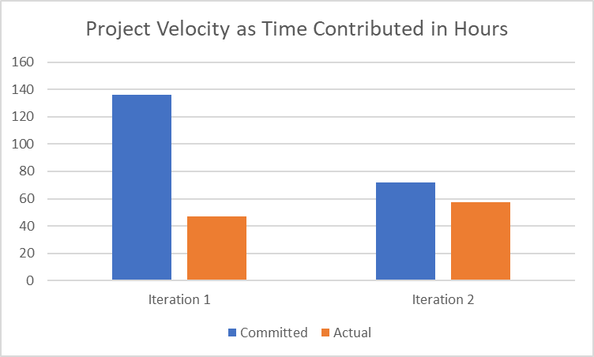
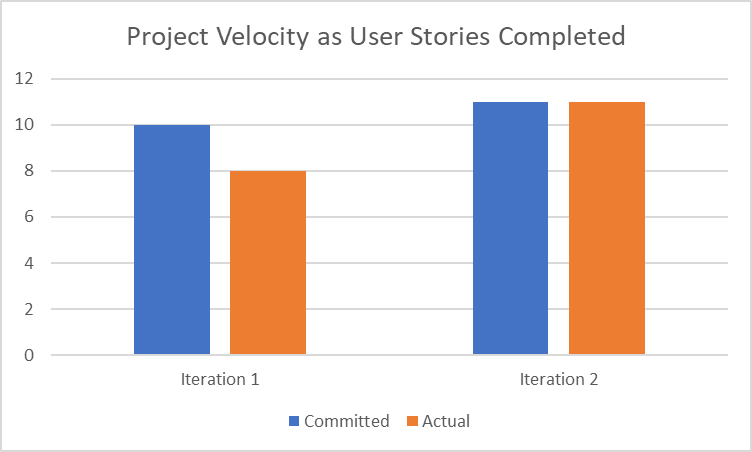

## IntelliCards Retrospective

TODO:

1. Discuss a part of your project that has not been as successful as you would have liked, and how it can be improved in this iteration
2. Determine concrete (and realistic) ways of improvement, and decide how its success will be evaluated at the end of the iteration (measurable and objective)

3. Include a chart (as an image) showing the 2 data points of project velocity from the last two iterations

